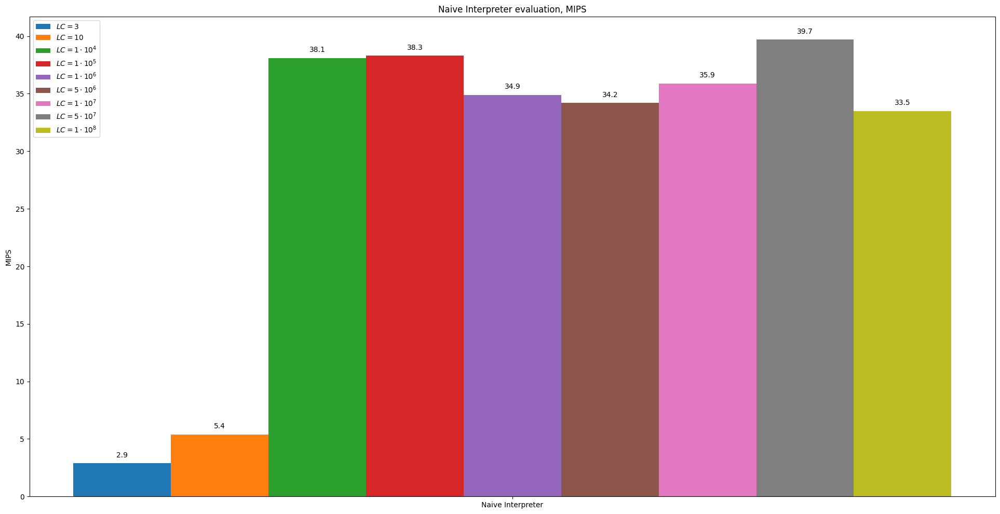

## Naive Interpreter

Interpretation in the general meaning of the word is the translation of text from one language to another.


In this section, we present a functional model of the processor for the toy RISC-like Instruction Set Architecture.

Our toy ISA was described in [```isa.hpp```](../lib/isa/include/sim/isa.hh).

```cpp
enum class Opcode : std::uint8_t {
  kUnknown = 0,
  kAdd,
  kHalt,
  kJump,
  kLoad,
  kStore,
  kBeq,
};
```

The operating algorithm is generally similar to the stage of the command execution pipeline in a real processor:

1. Fetch
2. Decode
3. Execute
4. Write back & Advance Program Counter


Let's take a look at the results of the model's performance for subsequent comparison with the simulator's optimizations.

### Benchmark

- MIPS:


- Time, seconds:

